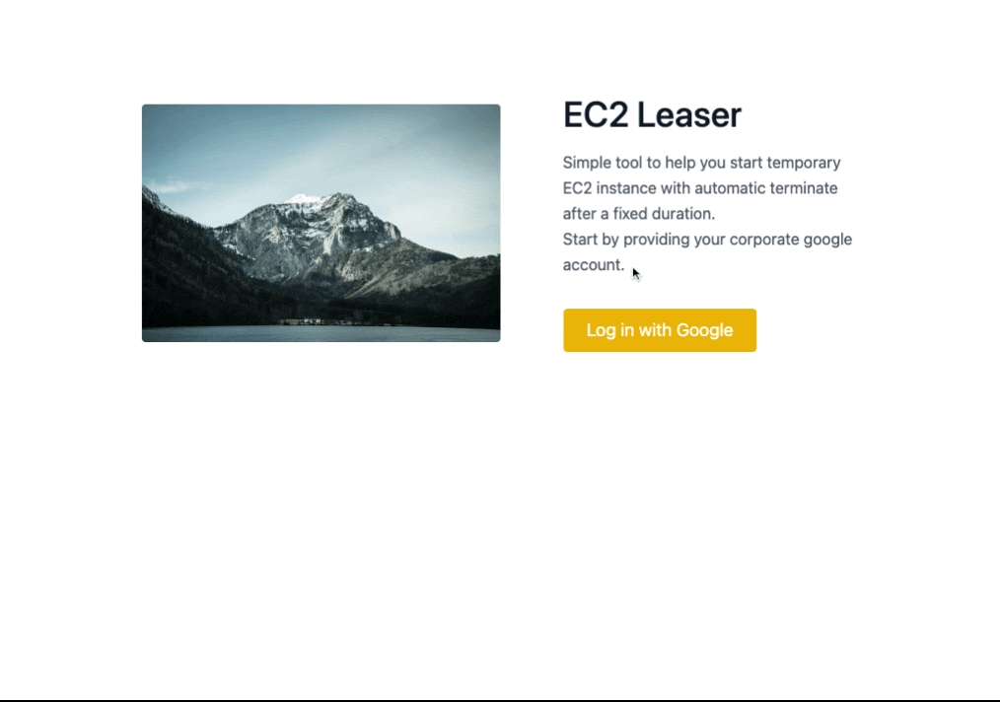

# ec2-leaser

A tiny tool to allow google user to start EC2 instances from a list of Launch Template already created. It can be used to not provide `startInstance` IAM right yo your users.



It's also possible to snapshot and restore instances!

## Architecture

The backend is managed serverlessly via [SST](https://sst.dev/).
The frontend is a React application. It's design to be deployed on AWS.

## How to run the application locally ?

Run the backend only (you need only that to use a local frontend):

```
pnpm install
pnpm dev
```

Start the frontend:

```
cd packages/web/
pnpm dev
```

no need to provide environment variables, are these are made available to the frontend via SST.

## How to deploy the application

Deploy the infrastructure with SST (front and back stack)
(it push the frontend to S3 and invalidate cloudfront distribution)

```
npx sst deploy --stage prod --region eu-central-1 # on aws prod account
npx sst deploy --stage demo --region us-east-1 # on aws demo account

```

### Cost center data content

To add cost center list so that the frontend can make use of it, add items directly from the AWS GUI:
visit [DynamoDB section](https://console.aws.amazon.com/dynamodbv2/home)
search for `{stage}-ec2-leaser-config`

See below for an example on how to enter the items in the table.

### Cost centers list

| PK          | SK          | description                          |
| ----------- | ----------- | ------------------------------------ |
| costcenters | eng:360Eyes | Usage for Engineering 360Eyes        |
| costcenters | eng:360WP   | Usage for Engineering 360WebPlatform |
| costcenters | eng:lab     | Generic Lab usage                    |

### Schedules list

| PK        | SK                   | description                                           |
| --------- | -------------------- | ----------------------------------------------------- |
| schedules | lille-office-stop    | Stop automatically the instance at 7pm (CET timezone) |
| schedules | montreal-office-stop | Stop automatically the instance at 7pm (EST timezone) |
